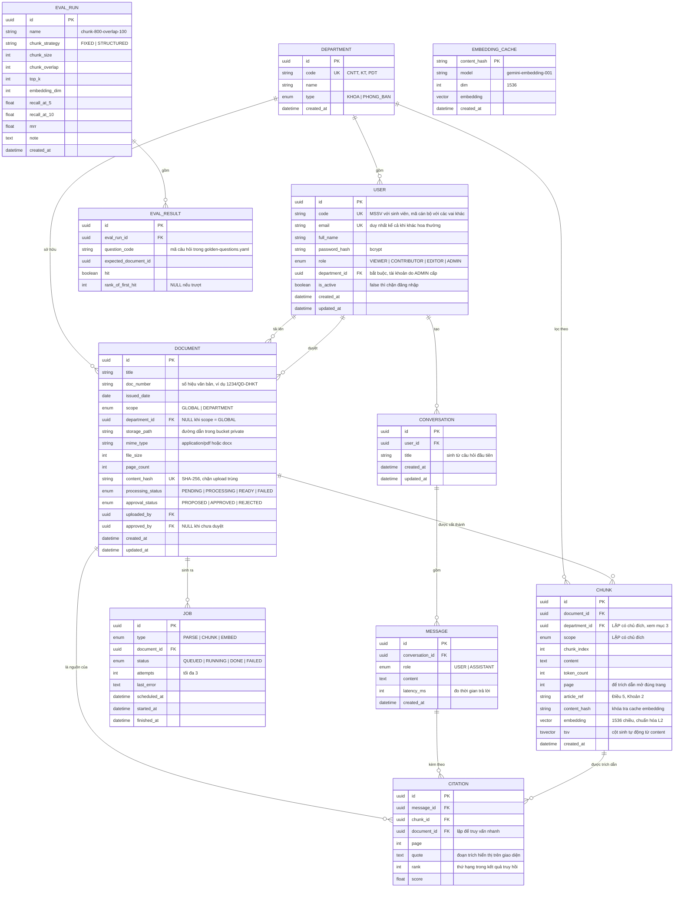

# Thiết kế cơ sở dữ liệu — Tàng Thư

**Cập nhật 22/08/2026** · PostgreSQL 16 + pgvector (Supabase) · Prisma ORM

Sơ đồ này là nguồn duy nhất cho `apps/backend/prisma/schema.prisma`. Sửa sơ đồ thì sửa schema, và ngược lại.

---

## 1. Sơ đồ thực thể – quan hệ



---

## 2. Vai trò từng bảng

| Bảng | Vai trò | Ai sở hữu |
|---|---|---|
| `departments` | Đơn vị: khoa hoặc phòng ban. Gốc của mọi phép lọc phạm vi | TV4 |
| `users` | Tài khoản do ADMIN cấp. Một người thuộc đúng một đơn vị, giữ đúng một vai. Đăng nhập bằng `code` hoặc `email` | TV4 |
| `documents` | Siêu dữ liệu văn bản. File thật nằm trên Supabase Storage, bảng này chỉ giữ đường dẫn | TV2 |
| `chunks` | Đoạn văn đã cắt, kèm vector và chỉ mục toàn văn. **Bảng trung tâm của truy hồi** | Đức |
| `embedding_cache` | Tra theo `content_hash` để không nhúng lại nội dung đã nhúng | Đức |
| `jobs` | Hàng đợi xử lý tài liệu, thay cho Redis | TV2 |
| `conversations` · `messages` | Lịch sử hội thoại | TV3 |
| `citations` | Nối câu trả lời về đúng đoạn văn nguồn | TV3 |
| `eval_runs` · `eval_results` | Số liệu so sánh các cấu hình cắt đoạn | Đức |

---

## 3. Ba quyết định thiết kế cần bảo vệ được

### a) Lặp `department_id` và `scope` xuống bảng `chunks`

Đây là **vi phạm chuẩn hóa có chủ đích**. Về lý thuyết, phạm vi của một đoạn văn suy được từ `documents` qua `document_id`, nên hai cột này là dư thừa.

Lý do vẫn lặp: chỉ mục HNSW không kết hợp tốt với phép JOIN lọc quyền. Nếu viết `JOIN documents ... WHERE d.department_id = ?`, Postgres phải lấy top-k theo vector *rồi* mới lọc — kết quả có thể rỗng hoặc thiếu vì k đoạn gần nhất đều thuộc khoa khác. Đặt cột lọc ngay trên `chunks` cho phép lọc **trước** khi xếp hạng.

Cái giá phải trả: khi tài liệu đổi đơn vị hoặc đổi phạm vi, phải cập nhật đồng bộ xuống tất cả `chunks` của nó. Xử lý bằng một transaction trong `ingest.service.ts`.

### b) `embedding` 1536 chiều, không phải 3072

`gemini-embedding-001` mặc định trả vector 3072 chiều, nhưng **chỉ mục HNSW của pgvector chỉ hỗ trợ tối đa 2000 chiều**. Nên hạ xuống 1536 qua tham số `output_dimensionality`.

Lưu ý bắt buộc: khi hạ chiều, vector trả về **không còn được chuẩn hóa L2 sẵn** như bản 3072. Phải tự chuẩn hóa trong `embed.ts` trước khi lưu, nếu không toán tử `<=>` cho khoảng cách sai.

### c) `tsv` là cột sinh tự động, dùng cấu hình `simple`

```sql
ALTER TABLE chunks ADD COLUMN tsv tsvector
  GENERATED ALWAYS AS (to_tsvector('simple', content)) STORED;
```

Dùng `'simple'` chứ không phải `'english'`: PostgreSQL không có từ điển tiếng Việt, mà `'english'` sẽ cắt gốc từ sai và loại nhầm từ dừng. `'simple'` chỉ tách từ và hạ chữ thường — đúng thứ cần để bắt số hiệu văn bản và tên riêng, vốn là phần mà embedding hay trượt.

Cột `GENERATED ALWAYS ... STORED` giúp không bao giờ quên cập nhật `tsv` khi sửa `content`.

**Cảnh báo khi viết truy vấn: `plainto_tsquery` nối các từ bằng AND.** Đã kiểm chứng trên dữ liệu mồi ngày 22/08/2026: câu hỏi *"điều kiện nhận đồ án tốt nghiệp bao nhiêu tín chỉ"* trả về **rỗng**, vì văn bản gốc không chứa hai từ "điều kiện" và "bao nhiêu" — chỉ cần một từ trong câu hỏi vắng mặt là toàn bộ truy vấn trượt.

Nhánh từ khóa của tìm kiếm lai phải dùng OR, không dùng AND:

```sql
replace(plainto_tsquery('simple', $1)::text, '&', '|')::tsquery
```

Cách này giữ nguyên phần tách từ và thoát ký tự đặc biệt của `plainto_tsquery`, chỉ đổi toán tử. Việc lọc bớt kết quả kém liên quan là nhiệm vụ của bước xếp hạng `ts_rank` và của hợp nhất RRF, không phải của mệnh đề khớp.

---

## 4. Chỉ mục

```sql
-- truy hồi vector
CREATE INDEX chunks_embedding_hnsw ON chunks
  USING hnsw (embedding vector_cosine_ops);

-- truy hồi toàn văn
CREATE INDEX chunks_tsv_gin ON chunks USING gin (tsv);

-- lọc phạm vi — chỉ mục quan trọng nhất của đồ án
CREATE INDEX chunks_scope_dept ON chunks (scope, department_id);

CREATE INDEX chunks_document ON chunks (document_id);
CREATE INDEX documents_dept_scope ON documents (department_id, scope, approval_status);
CREATE INDEX jobs_status_sched ON jobs (status, scheduled_at);
CREATE INDEX messages_conversation ON messages (conversation_id, created_at);
```

Tạo `chunks_embedding_hnsw` **sau khi** nạp xong dữ liệu — dựng chỉ mục HNSW trên bảng rỗng rồi chèn dần chậm hơn nhiều.

---

## 5. Ràng buộc toàn vẹn

| Ràng buộc | Diễn giải |
|---|---|
| `documents.content_hash` UNIQUE | Cùng một file upload hai lần thì báo trùng, không nhúng lại |
| `chunks (document_id, chunk_index)` UNIQUE | Không có hai đoạn cùng thứ tự trong một tài liệu |
| `scope = 'GLOBAL'` ⟹ `department_id IS NULL` | CHECK constraint trên cả `documents` và `chunks` |
| `scope = 'DEPARTMENT'` ⟹ `department_id IS NOT NULL` | CHECK constraint |
| `chunks.department_id` = `documents.department_id` | Bảo đảm bằng transaction khi ghi, kiểm lại trong test |
| Xóa `documents` ⟹ xóa `chunks`, `jobs` | `ON DELETE CASCADE` |
| Xóa `users` | Chặn — dùng `is_active = false` thay vì xóa, tránh gãy khóa ngoại từ `documents.uploaded_by` |
| Chỉ tài liệu `approval_status = 'APPROVED'` mới vào truy hồi | Điều kiện trong `retrieval.sql.ts` |

---

## 5b. Cảnh báo về migration tiếp theo

**Không dùng `prisma migrate diff` để sinh migration sau lần đầu.** Đã kiểm chứng ngày 22/08/2026: khi thêm cột `users.code`, lệnh diff sinh ra SQL kèm ba câu

```sql
DROP INDEX "public"."chunks_embedding_hnsw";
DROP INDEX "public"."chunks_tsv_gin";
DROP INDEX "public"."embedding_cache_embedding_hnsw";
ALTER TABLE "chunks" ALTER COLUMN "tsv" DROP DEFAULT;
```

Lý do: ba chỉ mục đó và cột sinh tự động được tạo bằng SQL viết tay, Prisma không biết chúng tồn tại nên coi là thừa và xóa đi. Áp dụng bản sinh tự động là **mất chỉ mục vector mà không có thông báo lỗi nào** — truy vấn vẫn chạy, chỉ chậm dần khi dữ liệu lớn lên, và rất khó truy ra nguyên nhân.

Quy trình đúng cho mọi migration từ lần thứ hai: **chạy `migrate diff` chỉ để XEM**, rồi tự viết file migration chứa đúng phần cần đổi, cuối cùng `migrate deploy`.

## 6. Ghi chú khi hiện thực bằng Prisma

Prisma chưa hỗ trợ kiểu `vector` và `tsvector`, nên khai báo bằng `Unsupported`:

```prisma
model Chunk {
  id        String  @id @default(uuid())
  content   String
  embedding Unsupported("vector(1536)")?
  tsv       Unsupported("tsvector")?
  // ...
}
```

Ba hệ quả:

1. Không đọc/ghi hai cột này qua Prisma Client — dùng `$queryRaw` và `$executeRaw`.
2. Ba lệnh ở mục 3c và toàn bộ chỉ mục ở mục 4 phải viết tay vào file migration SQL, `prisma migrate` không tự sinh.
3. Trước tất cả: bật extension trong migration đầu tiên.

```sql
CREATE EXTENSION IF NOT EXISTS vector;
```

Trên Supabase, extension `vector` bật sẵn ở schema `extensions` — kiểm tra lại bằng `SELECT * FROM pg_extension;` trước khi chạy migration đầu tiên.
