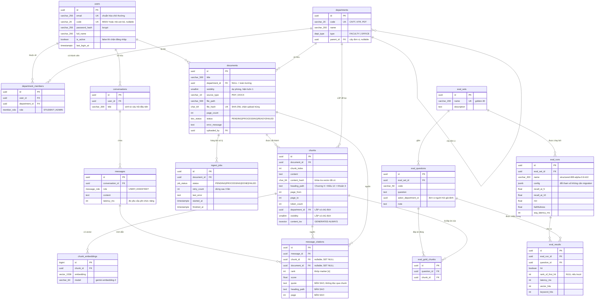

> **Cập nhật phạm vi 05/09/2026:** ứng dụng hiện chỉ phục vụ sinh viên CNTT, Đại học Kiến trúc Đà Nẵng; ba vai `USER`, `CONTENT_ADMIN`, `SYSTEM_ADMIN`. [PHAM-VI-CNTT.md](PHAM-VI-CNTT.md) và [phan-quyen.md](phan-quyen.md) là đặc tả hiện hành. Các phần hai vai/đa khoa bên dưới là thiết kế v2 được giữ để tham khảo, không còn là yêu cầu triển khai.

# Sơ đồ quan hệ dữ liệu — Sổ Tay Sinh Viên CNTT

**Bản v2.0 · viết lại 29/08/2026**

Nguồn của lược đồ là `server/prisma/schema.prisma`. Tài liệu này mô tả và giải thích *vì
sao*; khi hai bên lệch nhau thì file `.prisma` đúng.

Đối chiếu với cơ sở dữ liệu đang chạy bằng `pnpm --filter @tang-thu/server run db:check`
— **25/25 đạt** tính đến 29/08/2026.

> **Thay đổi so với bản v1.** Bốn vai xuống hai; `users.department_id` thay bằng bảng
> nhiều–nhiều `department_members`; cột `chunks.embedding` tách thành bảng riêng
> `chunk_embeddings` có cột `model`; bỏ luồng duyệt tài liệu (`approval_status`,
> `approved_by`); bỏ hai cột `scope` vì một cột `department_id` cho phép NULL đã đủ;
> thêm năm bảng cho bộ đánh giá. Tổng: **15 bảng, 5 enum**.

---

## 1. Sơ đồ



---

## 2. Bốn quyết định về mô hình dữ liệu

### 2.1 Lặp `department_id` và `visibility` xuống `chunks`

**Đây là quyết định quan trọng nhất của toàn bộ lược đồ.** Vi phạm chuẩn hóa 3NF một
cách có ý thức.

Ba phương án đã cân nhắc:

| | Cách làm | Kết quả |
|---|---|---|
| A | Lấy top-k toàn cục rồi lọc ở tầng ứng dụng | **Hỏng.** Nếu một khoa lớn chiếm phần lớn tài liệu, top-k toàn cục có thể không chứa đoạn nào thuộc khoa của người hỏi → câu trả lời rỗng dù dữ liệu tồn tại. Lỗi im lặng |
| B | JOIN sang `documents` để lọc, giữ chuẩn hóa | **Kém.** Bộ lập kế hoạch phải chọn giữa quét HNSW rồi lọc, hoặc lọc rồi quét tuần tự. Với bộ lọc chọn lọc cao nó thường chọn sai, độ trễ dao động mạnh theo phân bố dữ liệu |
| C | **Lặp cột lọc xuống `chunks`** ← đã chọn | Bộ lọc nằm cùng bảng với dữ liệu được xếp hạng, cho phép Postgres **lọc trước rồi mới xếp hạng** trên tập nhỏ. Độ trễ ổn định |

**Cái giá:** hai cột này có thể lệch với bảng cha. Lệch nghĩa là một tài liệu chuyển khoa
nhưng các đoạn văn của nó vẫn mang khoa cũ — tức sinh viên khoa cũ **vẫn đọc được** nội
dung đã chuyển đi. Rò rỉ, im lặng, không báo lỗi.

Cái giá đó được trả bằng **trigger trong CSDL**, không phải bằng việc trông chờ lập trình
viên nhớ cập nhật cả hai nơi:

```sql
CREATE TRIGGER documents_sync_chunk_scope
  AFTER UPDATE ON documents
  FOR EACH ROW EXECUTE FUNCTION sync_chunk_scope();
```

Hàm chỉ chạy `UPDATE chunks` khi `department_id` hoặc `visibility` thật sự đổi, nên thao
tác cập nhật tài liệu thông thường không tốn gì.

### 2.2 Tách `chunk_embeddings` khỏi `chunks`

Cho phép giữ **nhiều vector của cùng một đoạn**, từ các model khác nhau. Khi bộ đánh giá
cần so hai model, ta **thêm hàng** thay vì xóa và nạp lại toàn bộ. Ràng buộc
`UNIQUE(chunk_id, model)` bảo đảm mỗi cặp chỉ có một vector.

Cái giá là một phép JOIN trong truy vấn nóng — theo khóa chính nên rẻ.

> **Giới hạn cần biết.** Cột `embedding` có kiểu `vector(1536)` **cố định**. Hai model chỉ
> dùng chung bảng này được khi **cùng số chiều**; model khác chiều đòi migration đổi kiểu
> cột. Mục 11 của `THIET-KE-HE-THONG.md` nói "nạp song song vector của model mới rồi
> chuyển đổi không downtime" — câu đó chỉ đúng trong giới hạn này.

### 2.3 Vector 1536 chiều

Tài liệu thiết kế ghi 768; hiện thực dùng **1536**. Lý do và chi phí:

| | 768 | 1536 |
|---|---|---|
| Trần chỉ mục HNSW của pgvector | 2000 | 2000 — vẫn lọt |
| Vector cho 50.000 đoạn | ~150 MB | ~300 MB |
| Chỉ mục HNSW | ~250 MB | ~500 MB |
| Thời gian tính khoảng cách | 1× | ~2× (≈20 ms → ≈40 ms) |
| Chất lượng truy hồi | thấp hơn | **cao hơn** |

Ngân sách phi chức năng cho bước SQL là p95 < 300 ms, nên 40 ms còn thừa chỗ. Tổng CSDL
vẫn dưới 2 GB, chỉ là biên hẹp lại. **Cần sửa mục 3.2 và 9.1 tài liệu thiết kế cho khớp.**

Hai hệ quả bắt buộc:

- **Vẫn tự chuẩn hóa L2 trong `rag/embed.ts`.** `gemini-embedding-2` đã chuẩn hóa sẵn
  cả khi cắt ngắn, nhưng `gemini-embedding-001` thì không. Chuẩn hóa lại một vector đã
  chuẩn là vô hại, còn bỏ bước này sẽ tạo bẫy nếu sau này đổi model.
- **`maintenance_work_mem` phải ≥ 512 MB.** Mặc định 64 MB làm việc dựng chỉ mục HNSW
  500 MB tràn ra đĩa và chậm hàng chục lần. Đã đặt trong `docker-compose.yml`.

Cơ hội kèm theo: vì model dùng Matryoshka, gọi API **một lần** lấy 3072 chiều rồi cắt và
chuẩn hóa lại tại chỗ là có đủ cả 1536 lẫn 768 — **thí nghiệm so số chiều tốn 0 lệnh gọi
API**, thêm được một thí nghiệm vào bảng đánh giá mà không tốn tiền.

### 2.4 `message_citations` giữ bản sao

`quote`, `heading_path` và `page` được **sao chép** sang đây thay vì đọc qua `chunks`.
Nhờ vậy khi tài liệu bị gỡ, lịch sử hội thoại cũ **vẫn hiển thị được trích dẫn** — chỉ
mất đường dẫn mở file. Đó là lý do `chunk_id` và `document_id` cho phép NULL với hành vi
`ON DELETE SET NULL`.

---

## 3. Chỉ mục

Bốn chỉ mục dưới đây **Prisma không sinh được**, phải viết tay trong migration:

```sql
-- Tìm kiếm vector. m=16, ef_construction=64 cho recall ~0,95 so với quét vét cạn.
CREATE INDEX chunk_embeddings_embedding_hnsw ON chunk_embeddings
  USING hnsw (embedding vector_cosine_ops) WITH (m = 16, ef_construction = 64);

-- Nhánh từ khóa của tìm kiếm lai.
CREATE INDEX chunks_content_tsv_gin ON chunks USING gin (content_tsv);

-- Chặn hai tài khoản chỉ khác nhau hoa/thường ở email.
CREATE UNIQUE INDEX users_email_lower_key ON users (lower(email));

-- Cột sinh tự động; Postgres tự cập nhật nên không thể quên đồng bộ.
content_tsv tsvector GENERATED ALWAYS AS (to_tsvector('simple', content)) STORED
```

Cùng với trigger ở mục 2.1, đó là **năm khối SQL viết tay**.

### Chỉ mục do Prisma sinh

| Bảng | Chỉ mục | Phục vụ |
|---|---|---|
| `chunks` | `(department_id, visibility)` | **Quan trọng nhất của đồ án** — lọc phạm vi trước khi xếp hạng |
| `chunks` | `(content_hash)` | Tra vector đã có, khỏi gọi lại API |
| `chunks` | `(document_id, chunk_index)` UNIQUE | Thứ tự đoạn trong tài liệu |
| `documents` | `(department_id, visibility, status)` | Liệt kê tài liệu trong phạm vi |
| `documents` | `(file_hash)` UNIQUE | Chặn upload trùng ở tầng tài liệu |
| `department_members` | `(user_id, department_id)` UNIQUE | Một người một tư cách mỗi đơn vị |
| `ingest_jobs` | `(status, created_at)` | Worker lấy việc theo thứ tự |
| `conversations` | `(user_id, updated_at DESC)` | Danh sách hội thoại gần đây |
| `messages` | `(conversation_id, created_at)` | Đọc lại một hội thoại |
| `message_citations` | `(message_id, rank)` | Dựng panel nguồn theo thứ tự `[n]` |

---

## 4. Hành vi khi xóa

| Khóa ngoại | Hành vi | Vì sao |
|---|---|---|
| `department_members` → `users`, `departments` | `CASCADE` | Tư cách thành viên không có nghĩa khi thiếu một trong hai đầu |
| `chunks` → `documents` | `CASCADE` | Đoạn văn không sống ngoài tài liệu |
| `chunk_embeddings` → `chunks` | `CASCADE` | Vector không sống ngoài đoạn văn |
| `ingest_jobs` → `documents` | `CASCADE` | Job xử lý một tài liệu đã mất thì vô nghĩa |
| `conversations` → `users` | `CASCADE` | Hội thoại thuộc về người hỏi |
| `messages` → `conversations` | `CASCADE` | |
| `message_citations` → `messages` | `CASCADE` | |
| `message_citations` → `chunks`, `documents` | **`SET NULL`** | Giữ được lịch sử hội thoại khi tài liệu bị gỡ — xem mục 2.4 |
| `documents` → `departments`, `users` | `RESTRICT` | Không cho xóa đơn vị hay người dùng còn tài liệu treo |
| `chunks` → `departments` | `RESTRICT` | |
| `departments` → `departments` | `RESTRICT` | Không cho xóa đơn vị cha còn con |
| `eval_runs` → `eval_sets` | `RESTRICT` | Kết quả đo phải giữ được bộ câu hỏi đã dùng |

---

## 5. Cảnh báo vận hành

### 5.1 Chạy lại seed sẽ **xóa sạch** liên kết câu hỏi vàng

`seed.ts` xóa rồi tạo lại toàn bộ `chunks` của mỗi tài liệu. Vì `eval_gold_chunks.chunk_id`
có `ON DELETE CASCADE`, **mọi liên kết câu hỏi vàng ↔ đoạn văn bị xóa theo, không báo gì**.

Chưa gây hại lúc này vì bộ `golden-30` còn rỗng. Nhưng từ Sprint 4, khi đã gán 30 câu hỏi
với đáp án, một lần `pnpm db:seed` vô ý là mất trắng công gán tay. Trước Sprint 4 cần chọn
một trong hai: cho `seed.ts` upsert theo `(document_id, chunk_index)` thay vì xóa-rồi-tạo,
hoặc tách script gán câu hỏi vàng ra chạy lại được độc lập.

### 5.2 `prisma migrate` không biết năm khối SQL viết tay

`prisma migrate dev` **an toàn với Postgres local** — cảnh báo "phải viết tay" của bản v1
chỉ áp dụng cho Supabase. Nhưng năm khối ở mục 3 vẫn nằm ngoài tầm hiểu của Prisma, nên
một lần `migrate dev` sau này có thể lặng lẽ bỏ chúng đi.

**Mất chỉ mục HNSW không gây lỗi nào**: truy vấn vẫn trả kết quả đúng, chỉ chậm dần theo
lượng dữ liệu. Đó là kiểu hỏng tệ nhất. Vì vậy: **chạy `pnpm db:check` sau MỌI lần migrate.**

### 5.3 `eval_questions.asker_department_id` không có khóa ngoại

Cột này lưu đơn vị của người hỏi giả định, dùng để kiểm chứng cùng câu hỏi ở hai khoa cho
ra hai kết quả. Hiện nó là `uuid` trần, **không ràng buộc** tới `departments.id` — xóa một
đơn vị sẽ để lại tham chiếu treo. Nên thêm khóa ngoại khi dựng module `eval`.

### 5.4 Nhánh từ khóa phải dùng OR

`plainto_tsquery` nối **mọi** từ bằng `AND`, nên với câu hỏi tự nhiên nó gần như luôn trả
rỗng. Đã kiểm chứng. Phải viết:

```sql
replace(plainto_tsquery('simple', $q)::text, '&', '|')::tsquery
```

Mẫu đang dùng trong `scope-isolation.test.ts`; sao chép nguyên vào `retrieval.sql.ts`.

### 5.5 Cấu hình `'simple'` không chuẩn hóa dấu

Dùng `'simple'` thay vì `'english'` vì bộ stemmer tiếng Anh làm hỏng từ tiếng Việt.
Hạn chế đã biết và chấp nhận: `'simple'` chỉ tách token và hạ chữ thường, nên **"học phí"
và "hoc phi" không khớp nhau**. Ghi nhận là giới hạn, không xử lý trong 8 tuần.

### 5.6 Ghim `prisma` ở 6.16.x

CLI sẽ mời nâng lên 8.x — đừng nâng. Các bản mới báo schema drift sai trên cột
`Unsupported("vector")`: https://github.com/prisma/prisma/issues/28867
