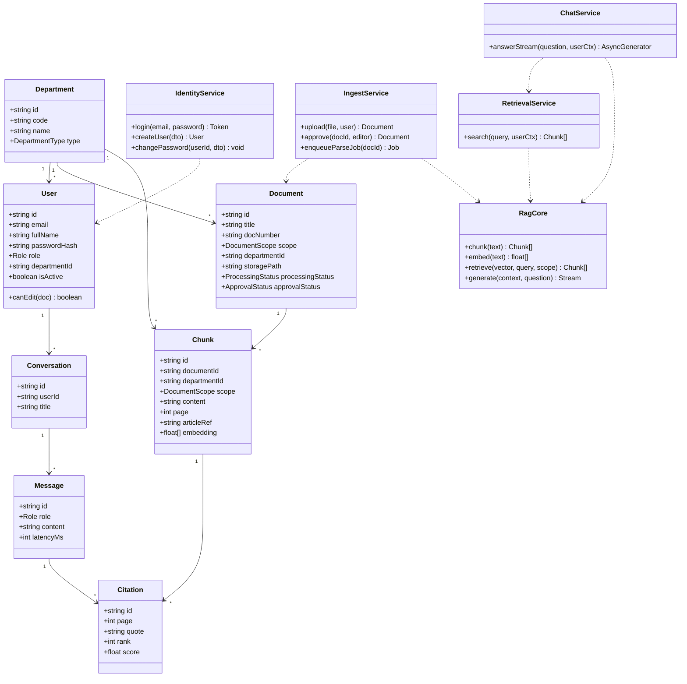
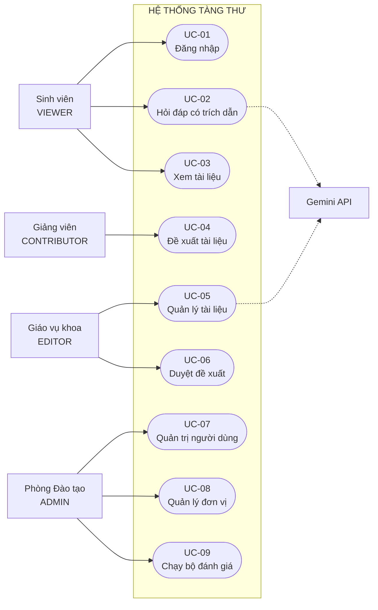
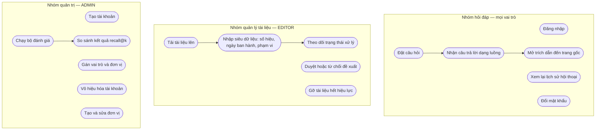
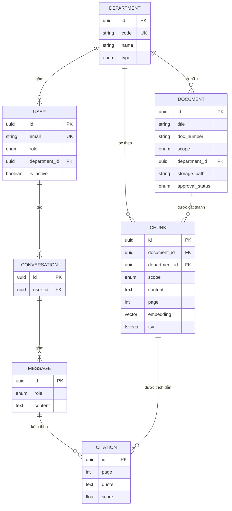
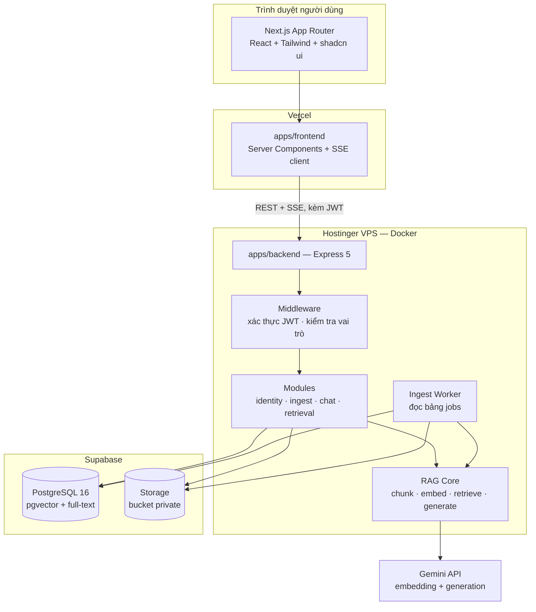
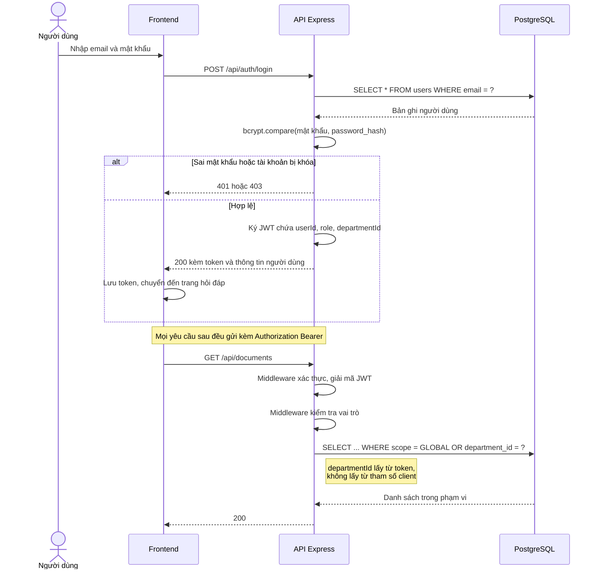
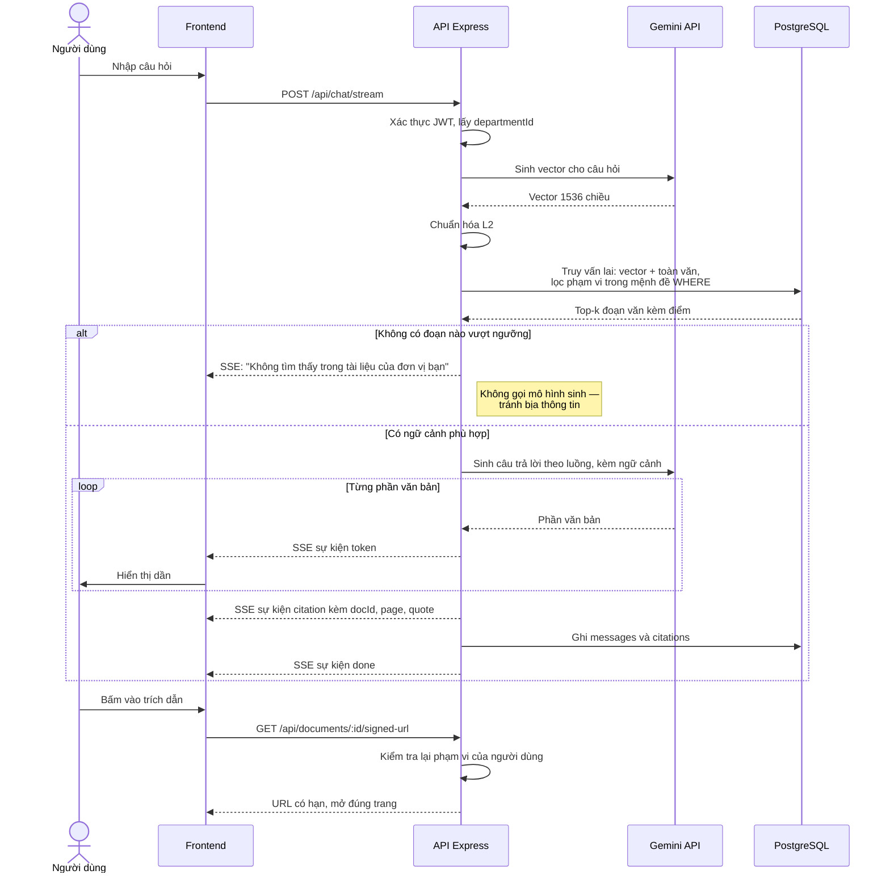
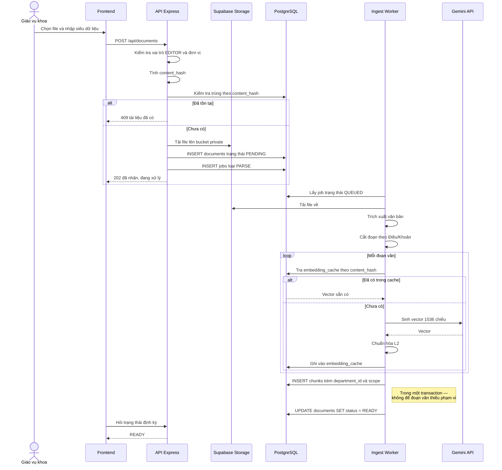

# CHƯƠNG 4: PHÂN TÍCH VÀ THIẾT KẾ HỆ THỐNG

**Đề tài:** Xây dựng hệ thống hỏi đáp tri thức học vụ ứng dụng RAG với cơ chế phân quyền theo đơn vị
**Sản phẩm:** Tàng Thư · **Cập nhật:** 22/08/2026

---

## 4.1. Khảo sát và phân tích yêu cầu

### a) Mô tả bài toán

Thông tin học vụ trong trường đại học hiện nằm rải rác trên nhiều kênh: website trường, website từng khoa, file PDF quy chế, thông báo trên mạng xã hội, giấy dán bảng tin. Qua khảo sát thực tế, tình trạng này gây ra ba hệ quả:

**Thứ nhất, sinh viên hỏi lặp lại.** Cùng một câu hỏi về điều kiện xét tốt nghiệp được gửi qua nhiều kênh khác nhau, và người hỏi không xác định được nguồn nào là chính thức, nguồn nào đã hết hiệu lực.

**Thứ hai, giáo vụ trả lời thủ công.** Chuyên viên giáo vụ khoa hằng ngày trả lời những câu hỏi mà đáp án đã có sẵn trong văn bản đã ban hành. Đây là công việc lặp lại, tốn thời gian, và không tạo ra giá trị mới.

**Thứ ba, ngữ cảnh sai lệch giữa các đơn vị.** Mỗi khoa có quy định riêng chồng lên quy chế chung của trường. Một câu trả lời đúng với sinh viên Khoa Công nghệ thông tin có thể sai với sinh viên Khoa Kinh tế. Đây là vấn đề khó nhất của bài toán.

Các công cụ hỏi đáp phổ thông như ChatGPT hay Gemini không giải quyết được bài toán này vì ba lý do: chúng không có dữ liệu nội bộ của trường, không phân biệt được người hỏi thuộc đơn vị nào, và có xu hướng bịa thông tin khi không biết — điều đặc biệt nguy hiểm với dữ liệu học vụ, nơi một câu trả lời sai về điều kiện tốt nghiệp gây hậu quả thật cho người học.

Hệ thống cần xây dựng phải đáp ứng ba đặc trưng: trả lời bằng tiếng Việt tự nhiên dựa trên tài liệu nội bộ, **chỉ trong phạm vi đơn vị mà người hỏi thuộc về**, và mọi câu trả lời đều kèm trích dẫn mở được đến văn bản gốc.

### b) Yêu cầu chức năng theo vai trò

Hệ thống định nghĩa bốn vai trò. Bảy chức danh có thật trong trường (sinh viên, giảng viên, cố vấn học tập, chủ nhiệm bộ môn, giáo vụ khoa, trưởng khoa, chuyên viên phòng ban) được ánh xạ vào bốn vai này, vì chúng chỉ tạo ra bốn mức quyền khác nhau.

| Mã | Chức năng | VIEWER | CONTRIBUTOR | EDITOR | ADMIN |
|---|---|:-:|:-:|:-:|:-:|
| CN-01 | Đăng nhập bằng tài khoản do nhà trường cấp | ✓ | ✓ | ✓ | ✓ |
| CN-02 | Đổi mật khẩu của chính mình | ✓ | ✓ | ✓ | ✓ |
| CN-03 | Đặt câu hỏi và nhận câu trả lời có trích dẫn | ✓ | ✓ | ✓ | ✓ |
| CN-04 | Xem lịch sử hội thoại của bản thân | ✓ | ✓ | ✓ | ✓ |
| CN-05 | Mở tài liệu gốc từ trích dẫn | ✓ | ✓ | ✓ | ✓ |
| CN-06 | Xem danh sách tài liệu trong phạm vi | ✓ | ✓ | ✓ | ✓ |
| CN-07 | Đề xuất tài liệu mới cho đơn vị | | ✓ | ✓ | ✓ |
| CN-08 | Tải lên, sửa, gỡ tài liệu của đơn vị | | | ✓ | ✓ |
| CN-09 | Duyệt hoặc từ chối tài liệu do CONTRIBUTOR đề xuất | | | ✓ | ✓ |
| CN-10 | Xem danh sách người dùng trong đơn vị | | | ✓ | ✓ |
| CN-11 | Tạo tài khoản, vô hiệu hóa tài khoản | | | | ✓ |
| CN-12 | Đổi vai trò và đơn vị của người dùng | | | | ✓ |
| CN-13 | Tạo, sửa, xóa đơn vị | | | | ✓ |
| CN-14 | Chạy bộ đánh giá và xem kết quả `eval_runs` | | | | ✓ |

Hệ thống **không có chức năng tự đăng ký tài khoản**. Nếu cho phép người dùng tự đăng ký và tự khai đơn vị của mình, bất kỳ ai cũng có thể tạo tài khoản khai thuộc Khoa Kinh tế rồi đọc toàn bộ tài liệu của khoa đó — cơ chế cách ly phạm vi bị vô hiệu ngay tại cửa vào. Tài khoản do quản trị viên (Phòng Đào tạo) cấp, đúng như quy trình thực tế của nhà trường.

### c) Yêu cầu phi chức năng

| Mã | Nhóm | Yêu cầu | Cách kiểm chứng |
|---|---|---|---|
| PCN-01 | Bảo mật | Phạm vi truy cập được kiểm soát ở **tầng truy vấn**, không phải tầng giao diện | Bộ kiểm thử cách ly phạm vi gồm 7 kịch bản |
| PCN-02 | Bảo mật | Đơn vị của người dùng lấy từ JWT đã ký, không lấy từ tham số của client | Kiểm thử giả mạo tham số `departmentId` |
| PCN-03 | Bảo mật | File gốc lưu trong bucket private, chỉ truy cập qua signed URL có hạn | Thử mở URL trực tiếp phải bị từ chối |
| PCN-04 | Bảo mật | Mật khẩu băm bằng bcrypt, không lưu dạng rõ | Kiểm tra bảng `users` |
| PCN-05 | Độ tin cậy | Không tìm được nguồn thì trả lời "không có trong tài liệu", tuyệt đối không suy đoán | Kịch bản hỏi câu ngoài phạm vi dữ liệu |
| PCN-06 | Độ tin cậy | Mọi câu trả lời đều kèm ít nhất một trích dẫn mở được đến đúng trang | Kiểm thử thủ công trên 30 câu hỏi vàng |
| PCN-07 | Hiệu năng | Token đầu tiên xuất hiện trong vòng 3 giây kể từ khi gửi câu hỏi | Đo `latency_ms` trong bảng `messages` |
| PCN-08 | Hiệu năng | Truy vấn truy hồi hoàn tất dưới 500 ms với 5.000 đoạn văn | Đo bằng `EXPLAIN ANALYZE` |
| PCN-09 | Khả năng đo lường | Chất lượng truy hồi được đo bằng recall@k trên ít nhất 3 cấu hình | Bảng `eval_runs` có tối thiểu 3 dòng |
| PCN-10 | Khả năng triển khai | Người mới clone mã nguồn, điền hai khóa API, chạy một lệnh là dùng được | Thử trên máy chưa từng cài đặt |
| PCN-11 | Chi phí | Nội dung không đổi thì không gọi lại API nhúng vector | Bảng `embedding_cache` theo `content_hash` |
| PCN-12 | Khả năng bảo trì | Lõi RAG tự cài đặt, không dùng framework trung gian, giải thích được từng dòng | Rà soát mã nguồn khi bảo vệ |

---

## 4.2. Sơ đồ lớp tổng quát

Hệ thống được cài đặt bằng TypeScript theo hướng hàm và mô-đun, không theo hướng đối tượng nặng. Sơ đồ dưới đây vì vậy mô tả **các lớp thực thể của miền nghiệp vụ và các thành phần dịch vụ**, phản ánh đúng cấu trúc mã nguồn thực tế, chứ không mô hình hóa những lớp không tồn tại.



Điểm cần lưu ý: `RagCore` là thành phần độc lập, không phụ thuộc vào HTTP hay cơ sở dữ liệu. Nó chỉ nhận tham số và trả dữ liệu, nhờ vậy kiểm thử được mà không cần dựng máy chủ. Đây là phần lõi do nhóm tự cài đặt, không sử dụng thư viện trung gian.

---

## 4.3. Sơ đồ Use-Case

### a) Sơ đồ Use-Case tổng quát



Ba vai CONTRIBUTOR, EDITOR, ADMIN kế thừa toàn bộ quyền của vai thấp hơn; sơ đồ chỉ vẽ phần quyền tăng thêm để tránh rối.

Tác nhân phụ **Gemini API** tham gia hai use-case: sinh câu trả lời (UC-02) và sinh vector khi xử lý tài liệu mới (UC-05).

### b) Sơ đồ Use-Case chi tiết theo vai



---

## 4.4. Đặc tả Use-Case

### a) UC-01 — Đăng nhập

| | |
|---|---|
| **Mã** | UC-01 |
| **Tác nhân** | Sinh viên, Giảng viên, Giáo vụ, Quản trị viên |
| **Mục tiêu** | Xác thực danh tính và xác định đơn vị của người dùng |
| **Tiền điều kiện** | Tài khoản đã được quản trị viên cấp và đang ở trạng thái hoạt động |
| **Hậu điều kiện** | Người dùng nhận được JWT chứa `userId`, `role`, `departmentId` |

**Luồng chính**

1. Người dùng mở trang đăng nhập, nhập email và mật khẩu
2. Hệ thống kiểm tra định dạng đầu vào
3. Hệ thống tìm tài khoản theo email
4. Hệ thống so khớp mật khẩu bằng bcrypt
5. Hệ thống kiểm tra `is_active = true`
6. Hệ thống ký JWT chứa định danh, vai trò và đơn vị
7. Giao diện lưu token và chuyển đến trang hỏi đáp

**Luồng ngoại lệ**

| Điều kiện | Xử lý |
|---|---|
| Email không tồn tại hoặc mật khẩu sai | Trả thông báo chung "Email hoặc mật khẩu không đúng" — không tiết lộ email nào có thật |
| Tài khoản bị vô hiệu hóa | Trả 403 kèm hướng dẫn liên hệ Phòng Đào tạo |
| Sai quá 5 lần trong 15 phút | Tạm khóa đăng nhập từ địa chỉ IP đó |

**Ghi chú thiết kế.** `departmentId` được đưa vào JWT ngay tại bước 6 và **không bao giờ nhận từ phía client**. Đây là điểm tựa của toàn bộ cơ chế cách ly phạm vi: client sửa token thì chữ ký hỏng, máy chủ từ chối.

### b) UC-02 — Hỏi đáp có trích dẫn

| | |
|---|---|
| **Mã** | UC-02 |
| **Tác nhân** | Mọi vai trò · Tác nhân phụ: Gemini API |
| **Mục tiêu** | Trả lời câu hỏi học vụ dựa trên tài liệu trong phạm vi của người hỏi |
| **Tiền điều kiện** | Người dùng đã đăng nhập; đã có tài liệu ở trạng thái `APPROVED` và `READY` |
| **Hậu điều kiện** | Câu hỏi và câu trả lời được lưu; các trích dẫn được ghi vào bảng `citations` |

**Luồng chính**

1. Người dùng nhập câu hỏi bằng tiếng Việt
2. Hệ thống xác thực JWT và lấy `departmentId`, `role`
3. Hệ thống sinh vector cho câu hỏi qua Gemini
4. Hệ thống truy vấn lai trên bảng `chunks`: kết hợp khoảng cách vector và hạng toàn văn, **lọc phạm vi ngay trong mệnh đề WHERE**
5. Hệ thống lấy top-k đoạn văn phù hợp
6. Hệ thống dựng ngữ cảnh và gọi Gemini sinh câu trả lời theo chế độ luồng
7. Từng phần câu trả lời được đẩy về giao diện qua SSE
8. Kết thúc luồng, hệ thống gửi danh sách trích dẫn
9. Hệ thống lưu `messages` và `citations`

**Luồng thay thế**

| Điều kiện | Xử lý |
|---|---|
| Bước 5 không tìm được đoạn văn nào | Trả lời "Không tìm thấy thông tin này trong tài liệu của đơn vị bạn" và dừng — **không gọi Gemini sinh câu trả lời** |
| Điểm tương đồng cao nhất dưới ngưỡng | Xử lý như trên |
| Gemini lỗi hoặc quá hạn | Gửi sự kiện lỗi qua SSE, giữ nguyên câu hỏi để người dùng thử lại |
| Mất kết nối giữa chừng | Ghi phần câu trả lời đã sinh, đánh dấu chưa hoàn tất |

**Ghi chú thiết kế.** Luồng thay thế thứ nhất là điều kiện bắt buộc của yêu cầu PCN-05. Nếu vẫn gọi mô hình sinh khi không có ngữ cảnh, mô hình sẽ trả lời bằng kiến thức chung — đúng cái sai nguy hiểm nhất mà đề tài này đặt ra để giải quyết.

### c) UC-03 — Tải tài liệu lên và xử lý

| | |
|---|---|
| **Mã** | UC-03 |
| **Tác nhân** | Giáo vụ khoa (EDITOR) |
| **Mục tiêu** | Đưa một văn bản học vụ vào kho tri thức của đơn vị |
| **Tiền điều kiện** | Đăng nhập với vai EDITOR trở lên |
| **Hậu điều kiện** | Tài liệu có `processing_status = READY`, các đoạn văn đã có vector |

**Luồng chính**

1. Người dùng chọn file PDF hoặc DOCX, nhập tiêu đề, số hiệu, ngày ban hành, phạm vi
2. Hệ thống kiểm tra định dạng và kích thước
3. Hệ thống tính `content_hash`; nếu trùng thì báo tài liệu đã tồn tại
4. Hệ thống tải file lên bucket private trên Supabase Storage
5. Hệ thống ghi bản ghi `documents` với trạng thái `PENDING`, tạo một job `PARSE`
6. Tiến trình nền lấy job, trích xuất văn bản
7. Tiến trình cắt đoạn theo cấu trúc Điều/Khoản
8. Với mỗi đoạn: tra `embedding_cache` theo `content_hash`; nếu chưa có thì gọi Gemini, chuẩn hóa L2, lưu vào cache
9. Ghi các đoạn vào bảng `chunks` **kèm `department_id` và `scope` sao chép từ tài liệu**
10. Cập nhật trạng thái `READY`

**Luồng ngoại lệ**

| Điều kiện | Xử lý |
|---|---|
| File là bản scan, không trích được văn bản | Đánh dấu `FAILED`, thông báo hệ thống không hỗ trợ tài liệu scan |
| Gemini lỗi ở bước 8 | Tăng `attempts`, thử lại tối đa 3 lần rồi mới đánh dấu `FAILED` |
| Người dùng chọn phạm vi ngoài đơn vị của mình | Trả 403 |

**Ghi chú thiết kế.** Bước 9 là nơi thực hiện việc lặp cột phạm vi xuống bảng `chunks`. Toàn bộ bước 9 và 10 nằm trong một transaction để không có tình trạng đoạn văn tồn tại mà thiếu thông tin phạm vi — nếu xảy ra, đó chính là một lỗ hổng rò rỉ.

### d) UC-04 — Duyệt tài liệu do giảng viên đề xuất

| | |
|---|---|
| **Mã** | UC-04 · **Tác nhân:** Giáo vụ khoa |
| **Tiền điều kiện** | Có tài liệu ở trạng thái `approval_status = PROPOSED` trong đơn vị |
| **Hậu điều kiện** | Tài liệu chuyển sang `APPROVED` và tham gia truy hồi, hoặc `REJECTED` |

**Luồng chính:** Giáo vụ mở danh sách đề xuất → xem trước nội dung và siêu dữ liệu → chọn duyệt hoặc từ chối kèm lý do → hệ thống ghi `approved_by` và thời điểm duyệt.

**Ghi chú.** Chỉ tài liệu `APPROVED` mới được đưa vào truy hồi. Điều kiện này nằm trong câu truy vấn, không nằm ở giao diện.

### e) UC-05 — Quản trị người dùng

| | |
|---|---|
| **Mã** | UC-05 · **Tác nhân:** Phòng Đào tạo (ADMIN) |
| **Tiền điều kiện** | Đăng nhập với vai ADMIN |
| **Hậu điều kiện** | Tài khoản được tạo, đổi vai/đơn vị, hoặc vô hiệu hóa |

**Luồng chính:** Quản trị viên mở màn quản trị → nhập email, họ tên, vai trò, đơn vị, mật khẩu tạm → hệ thống băm mật khẩu và tạo tài khoản → nhà trường chuyển mật khẩu tạm cho người dùng → người dùng đăng nhập và tự đổi mật khẩu.

**Luồng ngoại lệ:** email đã tồn tại → báo trùng. Vô hiệu hóa tài khoản đang có tài liệu đã tải lên → vẫn cho phép, vì hệ thống dùng cờ `is_active` chứ không xóa bản ghi, tránh gãy khóa ngoại.

---

## 4.5. Thiết kế cơ sở dữ liệu

Cơ sở dữ liệu gồm 11 bảng trên PostgreSQL 16 có bật extension `vector`. Sơ đồ đầy đủ kèm chỉ mục và ràng buộc toàn vẹn được trình bày trong tài liệu `docs/erd.md`; phần này tóm tắt các bảng cốt lõi phục vụ luồng truy hồi.



**Ba quyết định thiết kế cần bảo vệ được**

**Thứ nhất, lặp `department_id` và `scope` xuống bảng `chunks`.** Đây là vi phạm chuẩn hóa có chủ đích. Về lý thuyết, phạm vi của một đoạn văn suy được qua `document_id`. Tuy nhiên chỉ mục HNSW không kết hợp tốt với phép JOIN lọc quyền: nếu lọc sau khi đã lấy top-k theo vector, kết quả có thể rỗng hoặc thiếu vì k đoạn gần nhất đều thuộc đơn vị khác. Đặt cột lọc ngay trên bảng `chunks` cho phép lọc **trước** khi xếp hạng.

**Thứ hai, vector 1536 chiều thay vì 3072.** Mô hình `gemini-embedding-001` mặc định trả vector 3072 chiều, trong khi chỉ mục HNSW của pgvector chỉ hỗ trợ tối đa 2000 chiều. Hệ thống hạ xuống 1536 qua tham số `output_dimensionality`, đồng thời tự chuẩn hóa L2 vì vector sau khi cắt chiều không còn được chuẩn hóa sẵn.

**Thứ ba, cột `tsv` dùng cấu hình `simple`.** PostgreSQL không có từ điển tiếng Việt; cấu hình `english` sẽ cắt gốc từ sai và loại nhầm từ dừng. Cấu hình `simple` chỉ tách từ và hạ chữ thường — đúng thứ cần để bắt số hiệu văn bản và tên riêng, vốn là phần mà tìm kiếm ngữ nghĩa hay bỏ sót.

---

## 4.6. Thiết kế kiến trúc hệ thống

Hệ thống theo kiến trúc ba tầng, triển khai tách đôi: tầng giao diện chạy trên Vercel, tầng ứng dụng chạy trong Docker trên máy chủ riêng ảo, tầng dữ liệu dùng dịch vụ PostgreSQL quản lý.



**Giải thích các lựa chọn kiến trúc**

*Không dùng framework RAG trung gian.* Điểm nhấn kỹ thuật của đề tài nằm ở tầng truy vấn SQL — nơi các framework loại này trừu tượng hóa đi và làm mất khả năng chèn bộ lọc phân quyền trước bước xếp hạng. Toàn bộ lõi RAG khoảng 200 dòng, gồm bốn bước: cắt đoạn, nhúng vector, truy hồi, sinh câu trả lời.

*Hàng đợi bằng bảng trong cơ sở dữ liệu.* Việc xử lý tài liệu là tác vụ nền kéo dài. Thay vì thêm một dịch vụ hàng đợi riêng, hệ thống dùng bảng `jobs` với cột trạng thái. Cách này giảm một thành phần hạ tầng, phù hợp quy mô vài nghìn đoạn văn.

*Vector và toàn văn trên cùng một hệ quản trị.* PostgreSQL đảm nhiệm cả hai, nên tìm kiếm lai được thực hiện trong một câu truy vấn duy nhất, không phát sinh thêm hạ tầng và không phải đồng bộ dữ liệu giữa hai hệ thống.

*Tách frontend và backend.* Giao diện triển khai trên Vercel tận dụng mạng phân phối nội dung; máy chủ ứng dụng đặt trên VPS để chạy được tiến trình nền và giữ kết nối SSE dài. Hai bên khác nguồn gốc, nên token truyền qua tiêu đề `Authorization` thay vì cookie.

---

## 4.7. Thiết kế luồng xử lý

### a) Luồng đăng nhập và phân quyền



### b) Luồng hỏi đáp có truy hồi và trích dẫn



### c) Luồng tải tài liệu và xử lý nền



---

## 4.8. Thiết kế API

### a) Quy ước chung

Toàn bộ API theo chuẩn REST, dữ liệu trao đổi dạng JSON, riêng luồng trả lời dùng Server-Sent Events. Mọi phản hồi theo một khuôn dạng thống nhất:

```json
{ "success": true, "data": { } }
```

```json
{ "success": false, "error": { "code": "FORBIDDEN_SCOPE", "message": "Tài liệu không thuộc phạm vi của bạn" } }
```

Mã lỗi dùng chung: `UNAUTHENTICATED` · `FORBIDDEN_ROLE` · `FORBIDDEN_SCOPE` · `NOT_FOUND` · `VALIDATION_ERROR` · `DUPLICATE_DOCUMENT` · `UPSTREAM_ERROR`.

### b) Danh sách endpoint

| Phương thức | Đường dẫn | Vai tối thiểu | Mô tả |
|---|---|---|---|
| POST | `/api/auth/login` | — | Đăng nhập, trả JWT |
| GET | `/api/auth/me` | VIEWER | Thông tin người dùng hiện tại |
| PUT | `/api/auth/password` | VIEWER | Đổi mật khẩu của chính mình |
| POST | `/api/chat/stream` | VIEWER | Đặt câu hỏi, nhận câu trả lời dạng luồng SSE |
| GET | `/api/conversations` | VIEWER | Danh sách hội thoại của bản thân |
| GET | `/api/conversations/:id` | VIEWER | Chi tiết hội thoại kèm trích dẫn |
| GET | `/api/documents` | VIEWER | Danh sách tài liệu trong phạm vi |
| GET | `/api/documents/:id/signed-url` | VIEWER | URL có hạn để mở file gốc |
| POST | `/api/documents` | EDITOR | Tải tài liệu lên |
| PATCH | `/api/documents/:id` | EDITOR | Sửa siêu dữ liệu |
| DELETE | `/api/documents/:id` | EDITOR | Gỡ tài liệu |
| POST | `/api/documents/:id/propose` | CONTRIBUTOR | Đề xuất tài liệu cho đơn vị |
| POST | `/api/documents/:id/approve` | EDITOR | Duyệt đề xuất |
| POST | `/api/documents/:id/reject` | EDITOR | Từ chối đề xuất kèm lý do |
| GET | `/api/search` | VIEWER | Truy hồi thuần, phục vụ gỡ lỗi và đánh giá |
| GET | `/api/users` | EDITOR | Danh sách người dùng trong đơn vị |
| POST | `/api/users` | ADMIN | Tạo tài khoản |
| PATCH | `/api/users/:id` | ADMIN | Đổi vai trò hoặc đơn vị |
| PATCH | `/api/users/:id/disable` | ADMIN | Vô hiệu hóa tài khoản |
| GET | `/api/departments` | VIEWER | Danh sách đơn vị |
| POST | `/api/departments` | ADMIN | Tạo đơn vị |
| PATCH | `/api/departments/:id` | ADMIN | Sửa đơn vị |
| POST | `/api/eval/runs` | ADMIN | Chạy bộ đánh giá với một cấu hình |
| GET | `/api/eval/runs` | ADMIN | So sánh kết quả các lần chạy |

### c) Đặc tả chi tiết hai endpoint tiêu biểu

**POST /api/chat/stream**

Đầu vào:

```json
{ "question": "Điều kiện xét tốt nghiệp là gì?", "conversationId": "uuid hoặc bỏ trống" }
```

Đầu ra dạng SSE, ba loại sự kiện:

```
data: {"type":"token","text":"Theo Điều 12"}
data: {"type":"citation","documentId":"...","page":4,"quote":"...","score":0.82}
data: {"type":"done","messageId":"...","latencyMs":2840}
```

Mã lỗi: `401` chưa đăng nhập · `422` câu hỏi rỗng hoặc quá dài · `503` lỗi từ dịch vụ mô hình.

**POST /api/documents**

Đầu vào dạng `multipart/form-data`: `file` (PDF hoặc DOCX, tối đa 20 MB), `title`, `docNumber`, `issuedDate`, `scope`.

Đầu ra `202 Accepted`:

```json
{ "success": true, "data": { "id": "uuid", "processingStatus": "PENDING", "jobId": "uuid" } }
```

Mã lỗi: `403` không đủ vai trò hoặc chọn phạm vi ngoài đơn vị của mình · `409` tài liệu đã tồn tại theo `content_hash` · `422` sai định dạng hoặc vượt kích thước.

---

## Phụ lục — Ánh xạ sang tài liệu kỹ thuật

| Nội dung chương này | Tài liệu chi tiết trong mã nguồn |
|---|---|
| 4.1 b — Yêu cầu chức năng theo vai trò | `docs/phan-quyen.md` |
| 4.5 — Thiết kế cơ sở dữ liệu | `docs/erd.md` |
| 4.6 — Kiến trúc hệ thống | `docs/cau-truc-thu-muc.md` |
| 4.8 — Thiết kế API | `docs/api-contract.md` |
| Quyết định kỹ thuật | `docs/adr/` |
